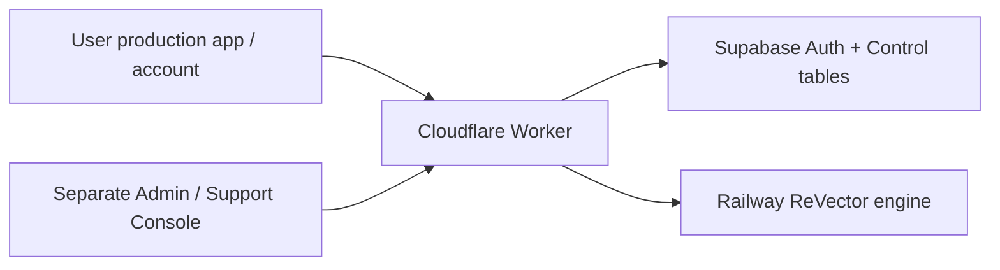

# ReVector Control Backend V1

This upgrade changes only **RevectorAi-WEB**. Railway ReVector remains the geometry,
vectorization, validation and export authority. No engine processing moved into
Supabase. No OpenAI integration or production configuration was performed.



## Separate interfaces and sessions

User workspace: `/`. Account: `/dashboard` and `/dashboard/{profile,balance,add-credits,usage,models,support}`.
User profile menu contains Profile, Balance, Add Credits, Usage, Select Models,
Support and Sign Out. Its DOM never includes admin navigation.

Operations: `/admin/login`, `/admin`, `/admin/{users,wallets,credits,usage,models,support,audit,settings}`.
The admin login is prerendered as its own static shell, including with JavaScript
disabled. Protected `/admin/*` pages require a verified operations session on the
Worker before assets are served. USER cannot enter. SUPPORT is limited to the
Support Inbox and replies; financial/global administration requires ADMIN.

Normal login does not create an admin session, including for a user with ADMIN
role. Both cookies are independently AES-GCM encrypted and bound to their cookie
name and web origin. HttpOnly, Secure on HTTPS, SameSite=Lax, host-only cookies.
Access/refresh tokens never enter browser JavaScript/localStorage. Each API request
verifies the Auth user and re-reads the active database profile/role. JWT
`user_metadata.role`, UI state and caller owner headers grant no authority.
Logout invalidates all ReVector sessions for the account and clears both cookies.
Supabase password policy remains authoritative; the UI/backend minimum is 12 characters.

The production rail remains Upload → Analyze → Enhance → Mockup → Detect Parts →
Vectorize → Validate → Download. Enhancement/mockup completion requires actual
engine metadata. With AI absent, these are shown as **Not used**. Existing engine
stages/IDs are preserved. Account navigation preserves active production jobs and
form inputs during background workflow rendering. Returning from an account page
initializes engine readiness when needed.

## Configuration and rollout (owner action, not executed here)

Required server-side Worker secret/configuration names:

- ENGINE_ORIGIN
- ENGINE_API_KEY
- SESSION_SIGNING_KEY
- SUPABASE_URL
- SUPABASE_ANON_KEY
- SUPABASE_SERVICE_ROLE_KEY
- CREDITS_PER_USD (only when priced credit charging is enabled)

Retain the existing engine origin and credentials. Service-role and session keys
must be stored as Cloudflare Worker secrets. Use Supabase's backend service-role
key and anon key; never insert either into HTML or browser code. The application
requires server-side configuration, not a Supabase JavaScript browser client.

1. Review `supabase/migrations/20261004190643_revector_control_v1.sql`. It uses
   prefixed tables and does not alter other JerseyOS tables or engine storage.
2. With explicitly approved Supabase access, initialize/link the CLI to the intended
   project if needed; apply the reviewed migration through the project migration
   workflow. Do not apply it to an unrelated connected project.
3. Disable public signup in Supabase Auth. Invite users through a trusted owner
   account. New Auth users deliberately receive no automatically privileged profile.
4. Provision a matching row in `revector_profiles`: `id = auth_user_id = invited
   Auth UUID`, verified email, role USER by default, status ACTIVE. The database
   creates a zero-balance wallet. First ADMIN/SUPPORT roles must be assigned by a
   trusted owner/database administrator; no self-promotion API exists.
5. Set the invitation email link to the web `/login?token_hash={{ .TokenHash }}&type=invite`
   flow. This frontend removes the token query immediately and sends it only to its
   same-origin Worker, which verifies it with Supabase. The user then sets a password.
   Do not use a browser access-token fragment as the invitation handoff.
6. Configure the Worker environment names above. Keep an existing SESSION_SIGNING_KEY
   stable; rotation deliberately invalidates sessions.
7. Test invitation/login, a USER attempting the admin login, separate authorized
   admin login, own data isolation, one audited top-up and real usage reconciliation
   against the configured project before announcing production account availability.

When all Supabase variables are empty, the existing signed anonymous engine
workflow continues and account screens explicitly report unavailable services.
**Partial configuration fails closed** for processing rather than downgrading to
anonymous identity. When configured, engine owners use `user_<verified Auth UUID>`.
Legacy anonymous projects are not silently reassigned to authenticated users;
any ownership migration needs a separately authorized, verified engine procedure.

## Schema and security

Nine tables: profiles, wallets, append-only wallet transactions, usage events,
model catalog, preferences, requests, append-only support messages, append-only
admin audit log. RLS is enabled on every exposed table. Authenticated direct reads
are owner-scoped; only `name/company` are directly updatable profile fields.
No authenticated/anonymous caller can execute financial/admin RPCs, write wallets,
modify roles or read the audit log. Admin access uses the trusted Worker and fresh
role checks; financial SQL RPCs also independently require an active ADMIN.
Private helper functions use a fixed empty search_path and invoker privileges.
Explicit grants avoid relying on Supabase default table/function privileges.

Support initial messages remain in ticket payloads; subsequent user/admin replies
are append-only conversation messages. Other users' tickets/replies are protected
by both server ownership and RLS. SUPPORT may reply but cannot adjust balances.

## Wallet and usage policy

Balances change only through an atomic transaction + append-only ledger entry.
The wallet row is locked; admin adjustments require a reason and UUID idempotency
key. Top-up approval locks the request, changes status, inserts the ledger entry
and creates an audit entry in one transaction. Rejection/reply never funds a wallet.
Repeating approval/adjustment cannot fund twice. No automated payment confirmation
or payment gateway was introduced.

Model preferences select enabled catalog rows or Auto. They are **preferences**,
not engine routing authority. An unavailable model request goes to the operations
console; approval requires an enabled model of the requested capability. Reply-only
is available without changing request status. Actual provider/model identity always
comes from the engine's successful metadata, never from the preference dropdown.

Catalog prices are centrally configured **fixed per-operation USD estimates**.
There is no fabricated token/image invoice. Default catalog entries are real
Cloudflare model identifiers with **UNPRICED** pricing and no invented prices.
Until verified prices and conversion are configured, unknown costs remain NULL
and no credit charge is invented. Credits are internal accounting units. Known
success costs convert with `ceil(USD × CREDITS_PER_USD)` for each operation.
Preflight reserves the sum of individually rounded upper estimates and snapshots
catalog pricing/conversion so queued jobs cannot acquire new prices retrospectively.
Failed operations default to zero credits, even if reported provider cost exists.
Deterministic processing has no AI cost.

Upload is streamed with byte/field limits. Every caller-supplied `auto_prepare` field
is stripped and one authoritative `false` field inserted, including unquoted or
repeated fields. The client then explicitly requests `/prepare`, enabling owned
project checks, reservation and request idempotency **before** AI dispatch. Uploads
cannot bypass billing through legacy auto preparation. Raster bytes are unmodified.

`X-Idempotency-Key` (UUID) is required for authenticated `/prepare`, `/ai-missing`,
`/assistant/explain`. Job dispatch is stored durably. Only actual successful AI
metadata yields usage records, keyed by project/operation/engine timestamp.
Repeated polling does not charge twice. COMPLETED/SUCCEEDED, FAILED and CANCELLED
jobs reconcile reservations. Binding failures can recover using a verified owned
job's project/stage. Usage page reads additionally reconcile up to five durable
pending jobs, so a return without browser job storage can finish accounting.
An accounting outage preserves accepted engine job responses and returns
`accounting_warning: USAGE_SYNC_PENDING`; balances remain subject to SQL reservations.

The current engine does **not** report Error Assistant model/cost or exact provider
invoices. Those fields remain unavailable rather than inferred. Failed calls without
attribution retain unknown mode/provider/model. Actual vs estimated cost is explicitly
stored. This implementation does not claim live Supabase/provider billing validation.

## API contract

All mutations require same-origin Origin and existing CSRF policy. JSON requests and
provider responses are bounded; transport uses HTTPS, finite timeouts, no redirects.
API responses use no-store. Engine secrets/owner headers are injected server-side.

| Endpoint | Behavior |
| --- | --- |
| GET /api/account/bootstrap | configured status and own verified profile, or signed-out/unavailable |
| POST /api/auth/login | invited active account password login; sets user cookie |
| POST /api/auth/invitation | verifies invitation token_hash; sets user cookie |
| POST /api/auth/password | updates own password through Supabase Auth |
| POST /api/auth/logout | invalidates account sessions and clears cookies |
| GET/PATCH /api/account/profile | own profile; only name/company may change |
| GET /api/account/wallet | own balance and reserved credits |
| GET /api/account/transactions | own ledger |
| GET /api/account/usage | own usage plus durable job reconciliation |
| GET /api/account/models | enabled catalog; routing=PREFERENCE_ONLY |
| GET/PUT /api/account/preferences | own allowed analyzer/image preference |
| GET/POST /api/account/requests | own top-up/model/support requests |
| GET /api/account/support/messages?request_id=UUID | own ticket conversation |
| POST /api/account/support/message | reply to own non-closed ticket |
| POST /api/admin/auth/login | separate ADMIN/SUPPORT login and cookie |
| POST /api/admin/auth/logout | operations sign out |
| GET /api/admin/session | verified operations profile |
| GET /api/admin/overview | measured aggregate operational counts/costs |
| GET /api/admin/users, wallets, transactions, usage, requests, audit, models | authorized global lists |
| GET /api/admin/support | support inbox with user identity/priority/status |
| GET /api/admin/support/messages?request_id=UUID | operations ticket history |
| POST /api/admin/support/reply | audited conversation reply + ticket status |
| POST /api/admin/wallet/adjust | user_id, delta, reason, idempotency_key |
| POST /api/admin/requests/decide | request_id, APPROVED/REJECTED/REPLY, response, idempotency_key; optional approved model_id |
| POST /api/admin/users/status | audited ACTIVE/SUSPENDED/DISABLED change; no self-disable |
| GET /api/admin/settings | safe control configuration; no secrets/infrastructure editor |
| POST /api/admin/models/update | authorized enabled flag, operation_prices JSON, pricing_version, reason |

List envelopes are `{items:[...]}`; pagination uses validated `offset`, 50 rows per
page. User-provided `user_id` filters never override verified identity. Requests
may be TOPUP, MODEL_CHANGE or SUPPORT; supported ticket categories and priority
are validated. Monetary bodies must be finite numbers within bounded limits.
Error envelope: `{success:false,error:{code,message,recoverable:true}}`; internal
SQL/credential failures are not returned verbatim. Existing ReVector normalized
errors, events and allowlisted advisory recovery APIs are preserved.

The engine remains responsible for eight canonical slots, manual/AI creation review,
true-vector validation, per-part SVG/EPS/PDF/ZIP. No assembled/master download was
added. The gateway also blocks canonical master/assembled vector artifact downloads;
internal composition remains available to the engine validator. Native `.ai` remains unavailable. Illustrator compatibility is a static/parser
report; actual Adobe Illustrator has not been run in this environment.

## Development and tests

```bash
npm ci
npm run check
npm test
npm run build
node scripts/browser-preview-smoke.cjs
npm run test:browser:account
```

For real engine integration, use an existing read-only engine checkout/interpreter:

```bash
REVECTOR_ENGINE_DIRECTORY=/path/to/RevectorAI-Tool node scripts/dev-local.cjs
# Separate terminal:
node scripts/browser-smoke.cjs
node scripts/browser-security.cjs
```

The launcher refuses to overwrite an existing `.dev.vars`, generates ephemeral
server keys, stores engine data outside its repository, and removes test credentials
on shutdown. Browser output defaults to ignored `test-results/`; override
`REVECTOR_QA_DIR` to an external artifact directory. Chromium and Inkscape,
Ghostscript, Poppler tools and unzip are required for full format verification.

PGlite tests execute the actual PostgreSQL migration/RLS/RPC code, not a ledger
mock. HTTP Auth/PostgREST and account browser fixtures are explicitly **test-only**;
no live Supabase users, credentials or payments are claimed. Main/PR GitHub Actions
run backend, browser/account and approved engine workflow regressions and publish
QA artifacts. The approved engine source commit is pinned and is never edited.
